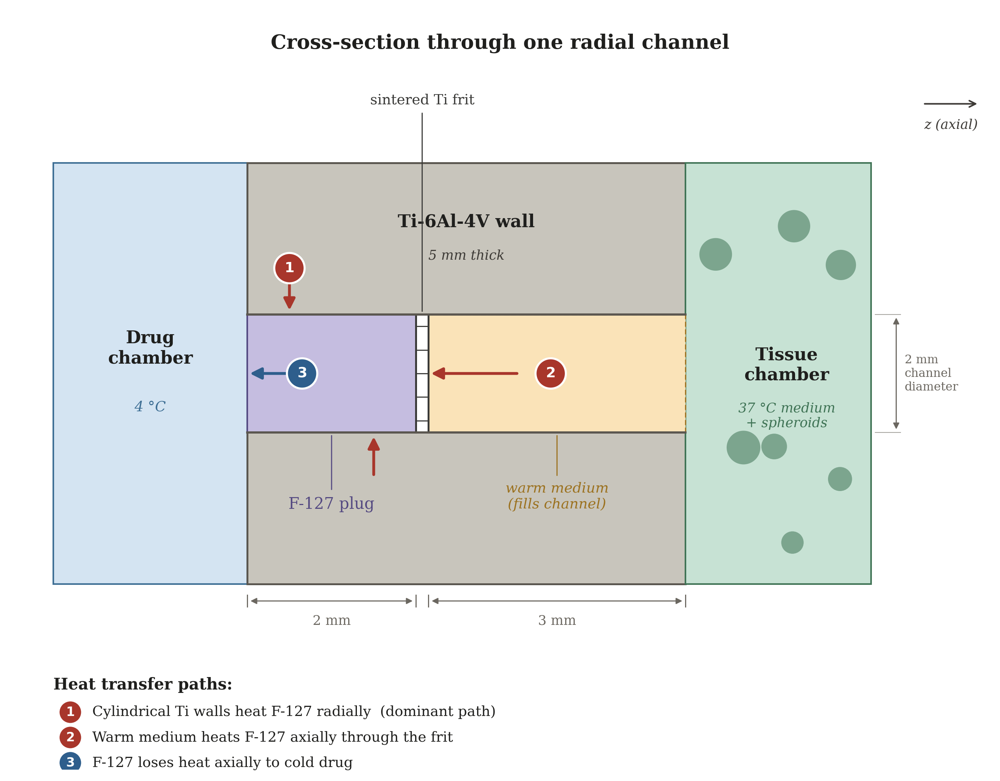
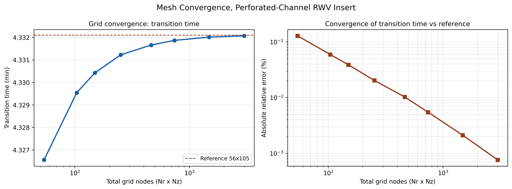
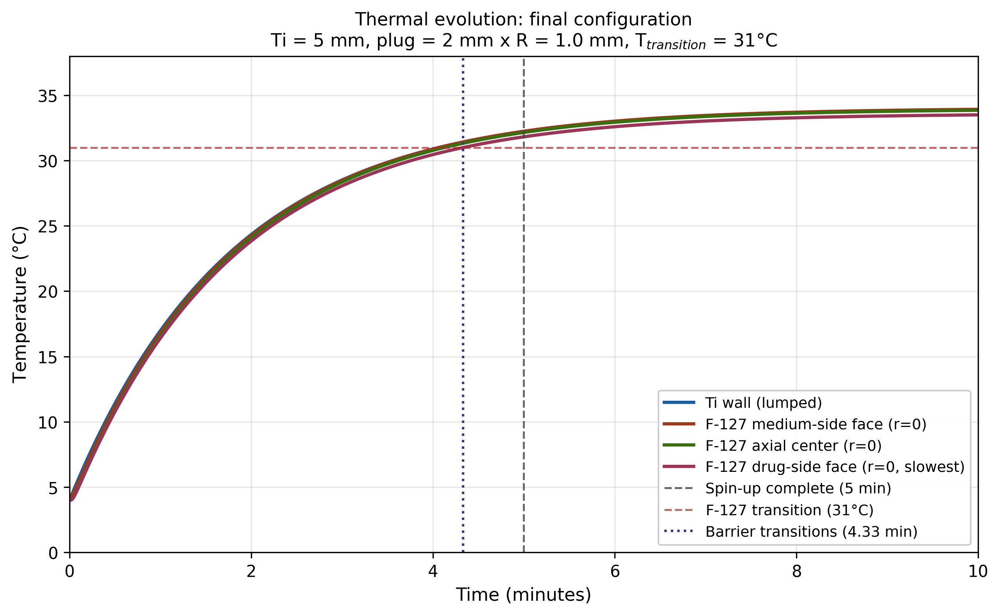
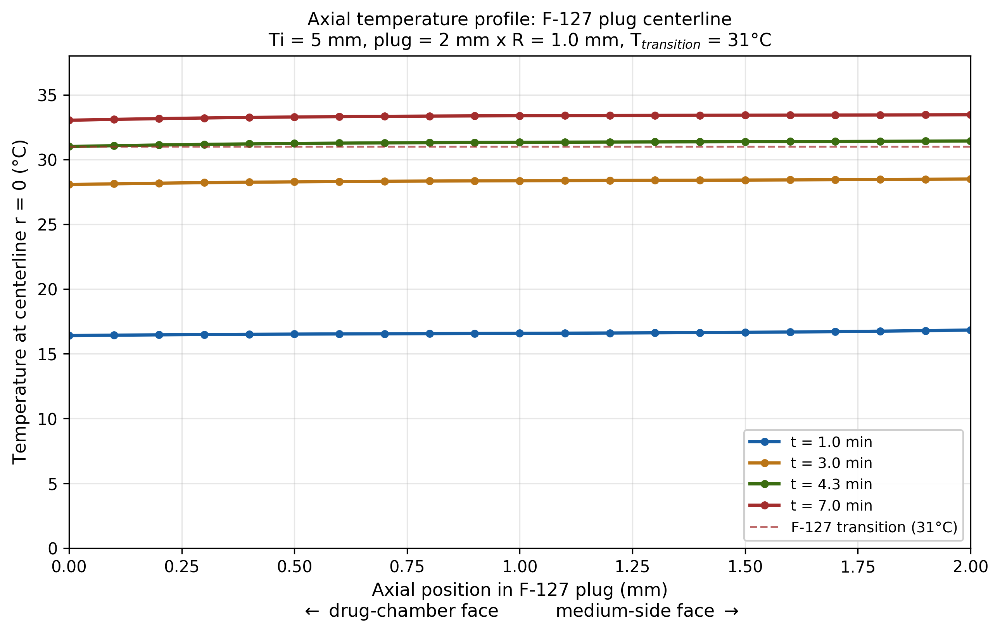
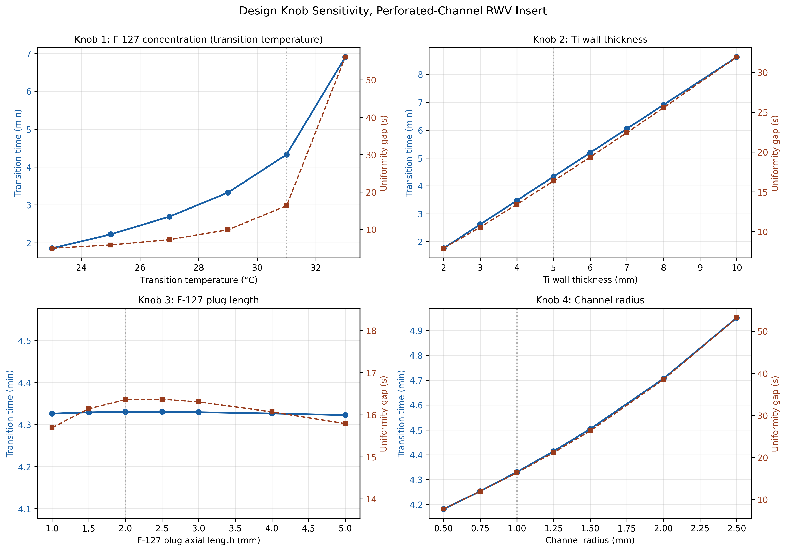
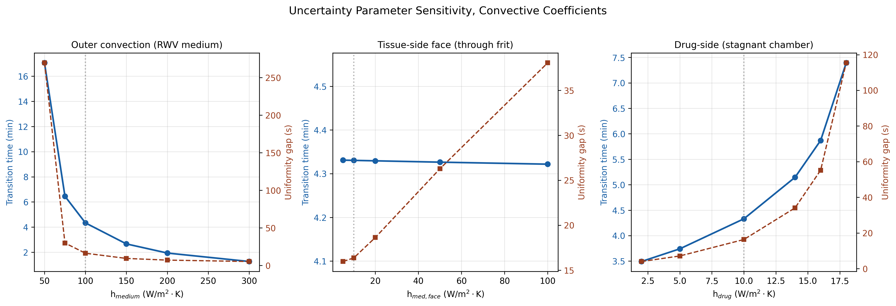

# RWV-Thermal-Model

2D axisymmetric finite-difference thermal model of a thermosensitive titanium insert that delays drug release in rotating wall vessel (RWV) bioreactors until simulated microgravity stabilises.

This is the computational work behind a design-concept paper accepted for the Undergraduate Student Poster Session at the **2026 ASGSR Annual Meeting** (Crystal City, VA, December 2026).

---

## The problem

RWV bioreactors simulate microgravity by rotating a fluid-filled cylinder about its horizontal axis. Spin-up to solid-body rotation takes roughly 5 minutes. Any drug added at `t = 0` therefore diffuses through changing gravity conditions during that window.

For a small molecule with `D = 5e-10 m^2/s`, the characteristic diffusion length over 5 minutes is

$$L = \sqrt{2Dt} = \sqrt{2 \times 5 \times 10^{-10} \times 300} \approx 0.55\ \text{mm}$$

In a 10 mm working gap that is enough early-time transport to contaminate kinetic measurements. For a 60-minute experiment it accounts for roughly 29% of total measured transport, and about 20% for a 120-minute experiment.

## The device

A Ti-6Al-4V insert splits the RWV working volume into an inner drug chamber and an outer tissue chamber. Eight radial channels (2 mm diameter, 5 mm long) are drilled through the wall. The inner 2 mm of each channel holds a Pluronic F-127 plug, retained by a sintered porous titanium frit.

The insert is loaded cold at 4 °C and placed in a 37 °C RWV. Heat conducts through the titanium into the plug, which crosses its ~31 °C sol-gel transition and then dissolves, releasing the drug after microgravity has stabilised.



## Governing equations

**Titanium wall.** With `Bi = h L / k = 0.071 < 0.1`, the wall is treated as lumped:

$$\rho_{Ti} c_{Ti} L_{Ti} \frac{dT_{Ti}}{dt} = h_{med}(T_{med} - T_{Ti}) - h_{drug}(T_{Ti} - T_{drug})$$

This has an exponential solution with a flux-weighted steady state

$$T_{Ti,\infty} = \frac{h_{med}T_{med} + h_{drug}T_{drug}}{h_{med} + h_{drug}} = 34\ ^\circ\text{C}$$

and time constant `tau ≈ 106 s`. Note the wall settles at 34 °C, not 37 °C, because it is in continuous contact with both the warm medium and the cold drug chamber. This constrains the design space: a transition temperature chosen too close to 34 °C will not reliably gel.

**F-127 plug.** Heated both radially and axially, so it needs a 2D treatment. Heat equation in cylindrical coordinates with axial symmetry:

$$\frac{\partial T}{\partial t} = \alpha_f \left[ \frac{1}{r}\frac{\partial}{\partial r}\left(r\frac{\partial T}{\partial r}\right) + \frac{\partial^2 T}{\partial z^2} \right]$$

with `alpha_f = 1.0e-7 m^2/s`.

**Boundary conditions**

| Boundary | Type | Condition |
|---|---|---|
| `r = R_ch` | Dirichlet | `T = T_Ti(t)`, justified by `k_Ti / k_F127 = 17.5` |
| `r = 0` | Symmetry | `dT/dr = 0` |
| `z = 0` (drug side) | Robin | `+k_f dT/dz = h_drug (T - T_drug)`, convective loss to the 4 °C drug chamber |
| `z = L_f` (medium side) | Robin | `-k_f dT/dz = h_med,face (T - T_medium)`, convective gain through the frit |

Both axial faces are written with the outward normal, so the drug-side sign differs from the medium-side sign.

## Numerical method

Explicit finite differences on a 12 x 21 grid. Timestep fixed at 40% of the explicit diffusion stability limit, giving `dt ≈ 9 ms` at baseline. At `r = 0` the singular `1/r` term resolves to a second `d2T/dr2` contribution. Face terms come from eliminating the ghost node in the flux balance.

The plug is defined as **transitioned** when the *minimum* temperature across all grid points exceeds `T_transition`. The gap between the first and last node to cross is reported as the **uniformity gap**.

**Grid independence.** Refining from the 12 x 21 reporting grid to a 56 x 105 reference shifts the predicted transition time by 0.02% (4.33123 min against 4.33211 min) and the uniformity gap by 0.09 s. Convergence is monotonic and the result is grid-independent to four significant figures. The 10 x 15 grid used for parameter sweeps is within 0.04% of the same reference.



Run `python convergence.py` to reproduce the table and this figure.

## Results



| Quantity | Value |
|---|---|
| Wall steady state | 34 °C |
| Wall time constant | ~106 s |
| Plug transition | 4.33 min |
| Uniformity gap | ~16 s |
| Predicted drug release | 6.3 to 7.3 min |
| Drug penetration into cold plug | 0.24 mm (12% of plug length) |

Radial conduction dominates. The axial path is 2 mm against 1 mm radially, and diffusion time scales as `L^2 / alpha`, so the axial timescale is 4x longer. The plug consequently heats near-uniformly, with internal gradients staying under 0.7 °C.



The drug-side face is the slowest point because it is the only outgoing heat path, and it therefore sets the transition criterion.

### Design parameter sensitivity



Four largely independent knobs:

- **Ti wall thickness** sets the thermal delay. Linear, ~0.86 min per mm. Cleanest tuning knob.
- **F-127 concentration** sets the transition temperature. Strongly nonlinear, since the driving temperature difference vanishes as `T_transition` approaches the 34 °C wall steady state.
- **Plug length** is decoupled from transition time entirely. Across 1 to 5 mm the transition shifts by under 0.5 s, because radial heating does not depend on axial length. It is chosen for dissolution delay and leakage margin instead.
- **Channel radius** has a modest effect on timing but a strong effect on uniformity (8 s to 53 s across 0.5 to 2.5 mm).

### Model uncertainty



Three convective coefficients are Nusselt-correlation estimates rather than measurements.

- `h_medium` dominates. A ±25% band around 100 W/(m^2·K) spreads the transition across 3.3 to 6.5 min. Even the slow end clears a typical spin-up window.
- `h_med_face` barely matters. A 20x sweep moves the transition by under 0.01 min, which is why the frit can be treated as thermally transparent.
- `h_drug` has a hard failure threshold near 22 W/(m^2·K), above which the wall steady state drops below the transition temperature and the device never gels. The practical limit is tighter: at 18 W/(m^2·K) the transition is already 7.4 min with a 115 s uniformity gap. A static, sealed drug chamber is therefore a functional requirement.

## Files

| File | Purpose | Figures |
|---|---|---|
| `rwv_model.py` | The solver. Lumped wall plus 2D axisymmetric plug. | 2, 3 |
| `rwv_sweep.py` | Parameter sweeps over design knobs and convective coefficients. | 4, 5 |
| `rwv_cross_section.py` | Schematic only. **Contains no physics**, coordinates are hardcoded for illustration. | 1 |
| `convergence.py` | Mesh convergence study against a 56 x 105 reference grid. | 6 |

## Running it

```bash
pip install -r requirements.txt
python rwv_model.py     # baseline run and figures 2, 3
python rwv_sweep.py     # sensitivity sweeps and figures 4, 5
python convergence.py   # mesh convergence study and figure 6
```

`rwv_sweep.py` imports from `rwv_model.py`, so keep both in the same directory.

## Limitations

This is a design concept supported by computational modelling. It is **not an experimentally validated prototype**, and no physical device has been built or tested.

- The three convective coefficients are estimated from Nusselt correlations, not measured. Direct measurement with thermocouples in a calibration insert is the highest-priority validation step.
- The sol-gel transition is treated as a sharp threshold at 31 °C. In reality it occurs gradually over roughly 28 to 32 °C.
- The drug chamber is treated as a constant 4 °C reservoir. It actually warms slowly through the surrounding titanium.
- Warm medium filling the outer 3 mm of each channel heats the titanium from the inside, which the model omits. This is an estimated ~10% extra heat flux and would shift the transition 10 to 20 s earlier, so the reported numbers are conservative against it.
- The 2 to 3 minute gel dissolution time is taken from published rates for thin F-127 layers, not computed here. It is the least constrained part of the analysis.
- The timestep is set from the diffusion stability limit only and does not include the Robin boundary term. All published coefficient ranges are stable, but very large convective coefficients would require a smaller timestep.

## Acknowledgements

This work originated as a group concept developed for a final project in ENGL 193 (Communication in the Sciences) at the University of Waterloo, taught by Dr. Jessica Van De Kemp. The original concept team was Omar El Herte, Sarah Baig, Ariana Habibian, Isadora Clark, Jason Gabriel, and the author.

The perforated-channel device architecture, the thermal model, and all code in this repository were developed independently afterward.

AI tools (Claude, Anthropic) assisted with implementing the numerical model and its Python code. All design choices, physical assumptions, and conclusions are my own.

## License

MIT. See `LICENSE`.

## Author

Lakshya Ramnani, Honours Physics, University of Waterloo.
